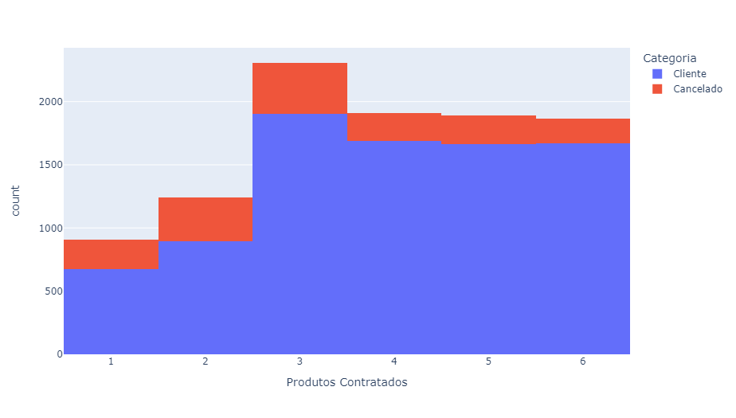
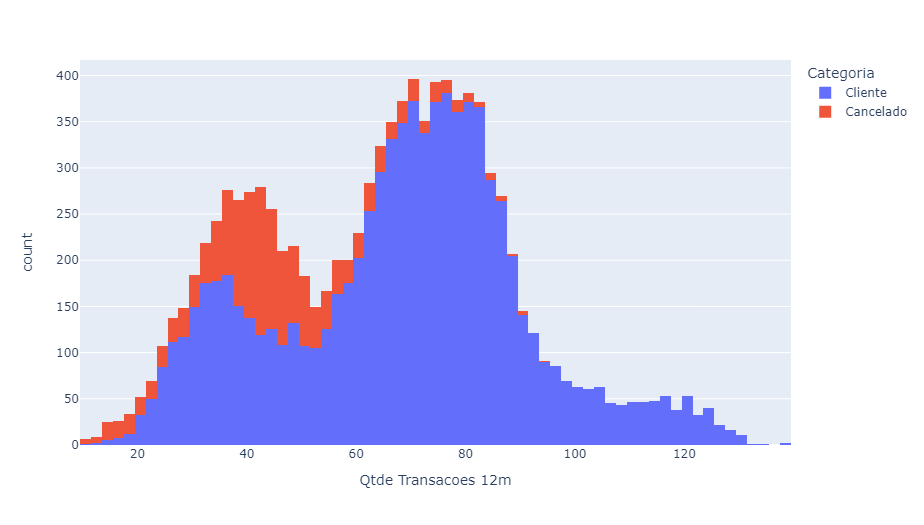
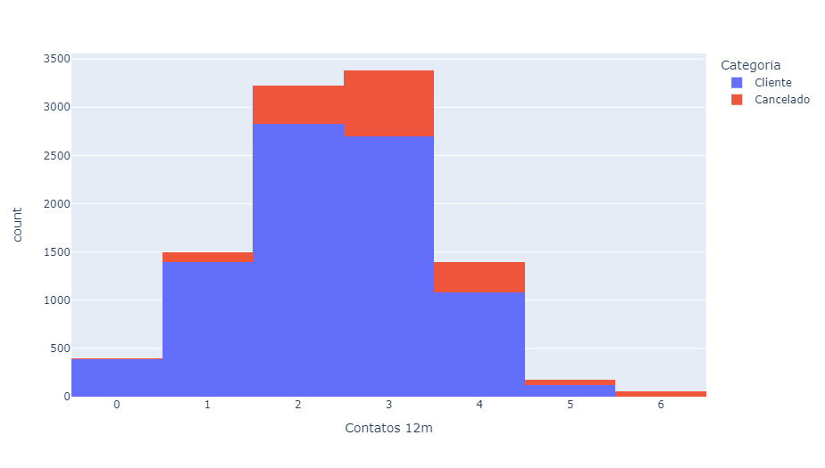

# Análise de Dados sobre Cancelamento de Cartão de Crédito 📊💳

Bem-vindo ao nosso mais recente projeto de análise de dados, onde mergulhamos fundo na problemática do cancelamento de cartão de crédito. Na era da análise preditiva e da inteligência artificial, não podemos ignorar os insights valiosos que os dados podem nos fornecer. Este repositório contém uma análise técnica detalhada, empacotada em um notebook Jupyter, explorando padrões, identificando tendências e construindo modelos preditivos para enfrentar esse desafio empresarial.

## Desafio 🎯

Imagine a cena: você, um gigante da indústria de cartões de crédito, enfrenta uma maré crescente de cancelamentos de cartões. As perdas financeiras são significativas e a pressão para reter clientes está aumentando. Mas, com dados em mãos, você pode mudar o jogo. Nosso desafio? Utilizar técnicas avançadas de análise de dados para identificar os clientes em risco de cancelamento e desenvolver estratégias eficazes para retê-los.

## Referência dos Dados 📊💾

Os dados utilizados para esta análise foram obtidos a partir de uma base de dados disponível no Kaggle, especificamente no seguinte link: [Referência: Kaggle - Credit Card Customers Dataset](https://www.kaggle.com/sakshigoyal7/credit-card-customers).

Este conjunto de dados contém informações sobre clientes de cartão de crédito, incluindo clientes atuais e aqueles que cancelaram o cartão. Ele fornece uma ampla gama de variáveis, incluindo características demográficas, histórico de transações e comportamento de pagamento.

## Técnicas Utilizadas 🛠️

Nossa abordagem técnica incorpora uma variedade de técnicas avançadas:

1. **Exploração de Dados**: Inicialmente, realizamos uma exploração detalhada dos dados, utilizando Pandas e NumPy para manipulação eficiente de dados.

2. **Pré-processamento de Dados**: Tratamos valores ausentes, lidamos com dados duplicados e realizamos uma limpeza geral dos dados para garantir sua qualidade.

3. **Visualização de Dados**: Utilizamos bibliotecas como Matplotlib e Seaborn para criar visualizações claras e informativas que destacam padrões e tendências nos dados.

4. **Análise Estatística**: Aplicamos técnicas estatísticas avançadas para extrair insights significativos dos dados, incluindo correlações e distribuições.

5. **Modelagem Preditiva**: Implementamos modelos de aprendizado de máquina, como regressão logística e árvores de decisão, para prever o cancelamento de cartões com base em características dos clientes.

6. **Avaliação de Modelos**: Avaliamos o desempenho dos nossos modelos utilizando métricas como precisão, recall e F1-score para garantir a robustez e confiabilidade das previsões.

## Resultados 📈📉

Nossa análise revelou insights valiosos sobre o comportamento dos clientes e fatores que influenciam o cancelamento de cartões:

- Identificamos uma forte correlação entre a quantidade de produtos contratados por um cliente e a probabilidade de cancelamento - clientes com mais produtos tendem a cancelar menos.

- A quantidade e o valor das transações também têm um impacto significativo na probabilidade de cancelamento - clientes com transações mais frequentes e de maior valor tendem a cancelar menos.

- Curiosamente, observamos que um maior número de tentativas de contato com o cliente pode realmente aumentar a probabilidade de cancelamento, sugerindo a importância de abordagens mais personalizadas e direcionadas.

